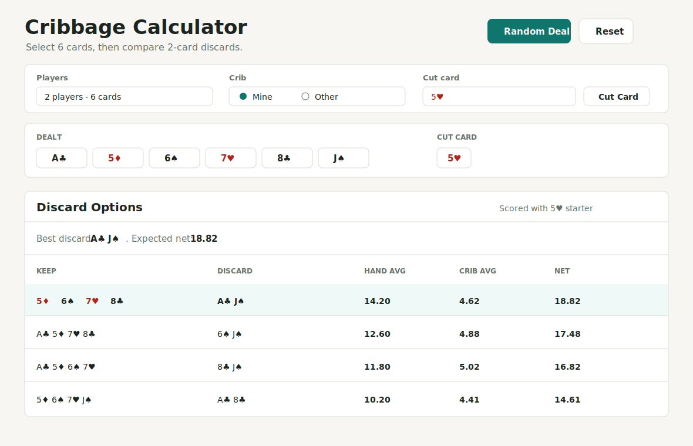

# Cribbage Calculator

A quick browser-based cribbage hand calculator for comparing discard choices. It runs as a static page, so there is no install or build step.

## What It Does

- Select 2, 3, or 4 players.
- Choose whether the crib is yours or another player's.
- Pick your dealt cards directly from the dealt-card slots.
- Use `Scan hand` to fill dealt cards from a camera/photo with browser-side OCR.
- Use `Random Deal` to instantly deal a 6-card hand.
- Use `Cut Card` to flip a random remaining cut card.
- Compare all legal discard options by hand average, crib average, and net value.

## How To Use

Open [index.html](index.html) in a browser.

For a quick 2-player hand, click `Random Deal`, then review the discard table. Click `Cut Card` when you want to score against an exact cut card instead of averaging across all possible cuts.

To scan a real hand, click `Scan hand` and choose or capture a clear photo of the card faces. The scanner fills any cards it can read; any uncertain slots can still be adjusted manually.

The `Net` column accounts for crib ownership:

- Your crib: `hand average + crib average`
- Other crib: `hand average - crib average`

## Files

- [index.html](index.html): App markup.
- [styles.css](styles.css): Layout and visual styling.
- [script.js](script.js): Cribbage scoring, random deal/cut logic, and UI behavior.
- [docs/screenshot.svg](docs/screenshot.svg): README preview image.
